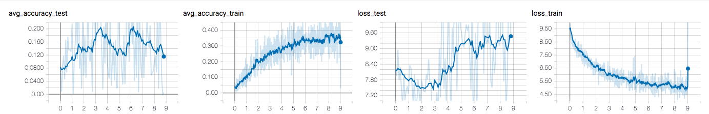

# dcn-tensorflow

This repository contains tensorflow implementation of Dynamic Coattention Networks For Question Answering [1].

I tried to apply it to question-answering problem for Russian language. 

For training i used emdeddings from RusVectōrēs [2]. I trained model using aws p2.xlarge instance.

My opinion that model is hard and long to train.

* [1] https://arxiv.org/abs/1611.01604
* [2] http://rusvectores.org/ru/models/
